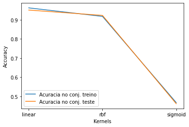
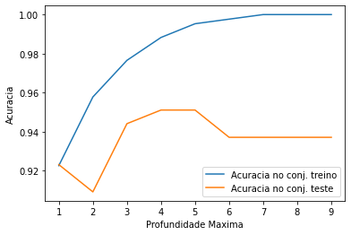
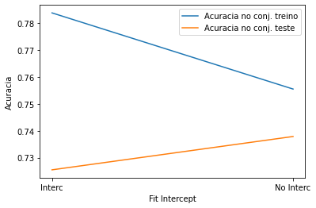

```python
from sklearn.datasets import load_breast_cancer 
from sklearn.datasets import load_diabetes 
from sklearn import svm 
from sklearn.tree import DecisionTreeClassifier 
from sklearn.linear_model import LinearRegression 
from sklearn.model_selection import train_test_split 
import matplotlib.pylab as plt
%matplotlib inline
```


```python
print(load_breast_cancer().feature_names)
print(load_breast_cancer().target_names)
```

    ['mean radius' 'mean texture' 'mean perimeter' 'mean area'
     'mean smoothness' 'mean compactness' 'mean concavity'
     'mean concave points' 'mean symmetry' 'mean fractal dimension'
     'radius error' 'texture error' 'perimeter error' 'area error'
     'smoothness error' 'compactness error' 'concavity error'
     'concave points error' 'symmetry error' 'fractal dimension error'
     'worst radius' 'worst texture' 'worst perimeter' 'worst area'
     'worst smoothness' 'worst compactness' 'worst concavity'
     'worst concave points' 'worst symmetry' 'worst fractal dimension']
    ['malignant' 'benign']
    


```python
print(load_diabetes().feature_names)
print(load_diabetes().target)
```

    ['age', 'sex', 'bmi', 'bp', 's1', 's2', 's3', 's4', 's5', 's6']
    [151.  75. 141. 206. 135.  97. 138.  63. 110. 310. 101.  69. 179. 185.
     118. 171. 166. 144.  97. 168.  68.  49.  68. 245. 184. 202. 137.  85.
     131. 283. 129.  59. 341.  87.  65. 102. 265. 276. 252.  90. 100.  55.
      61.  92. 259.  53. 190. 142.  75. 142. 155. 225.  59. 104. 182. 128.
      52.  37. 170. 170.  61. 144.  52. 128.  71. 163. 150.  97. 160. 178.
      48. 270. 202. 111.  85.  42. 170. 200. 252. 113. 143.  51.  52. 210.
      65. 141.  55. 134.  42. 111.  98. 164.  48.  96.  90. 162. 150. 279.
      92.  83. 128. 102. 302. 198.  95.  53. 134. 144. 232.  81. 104.  59.
     246. 297. 258. 229. 275. 281. 179. 200. 200. 173. 180.  84. 121. 161.
      99. 109. 115. 268. 274. 158. 107.  83. 103. 272.  85. 280. 336. 281.
     118. 317. 235.  60. 174. 259. 178. 128.  96. 126. 288.  88. 292.  71.
     197. 186.  25.  84.  96. 195.  53. 217. 172. 131. 214.  59.  70. 220.
     268. 152.  47.  74. 295. 101. 151. 127. 237. 225.  81. 151. 107.  64.
     138. 185. 265. 101. 137. 143. 141.  79. 292. 178.  91. 116.  86. 122.
      72. 129. 142.  90. 158.  39. 196. 222. 277.  99. 196. 202. 155.  77.
     191.  70.  73.  49.  65. 263. 248. 296. 214. 185.  78.  93. 252. 150.
      77. 208.  77. 108. 160.  53. 220. 154. 259.  90. 246. 124.  67.  72.
     257. 262. 275. 177.  71.  47. 187. 125.  78.  51. 258. 215. 303. 243.
      91. 150. 310. 153. 346.  63.  89.  50.  39. 103. 308. 116. 145.  74.
      45. 115. 264.  87. 202. 127. 182. 241.  66.  94. 283.  64. 102. 200.
     265.  94. 230. 181. 156. 233.  60. 219.  80.  68. 332. 248.  84. 200.
      55.  85.  89.  31. 129.  83. 275.  65. 198. 236. 253. 124.  44. 172.
     114. 142. 109. 180. 144. 163. 147.  97. 220. 190. 109. 191. 122. 230.
     242. 248. 249. 192. 131. 237.  78. 135. 244. 199. 270. 164.  72.  96.
     306.  91. 214.  95. 216. 263. 178. 113. 200. 139. 139.  88. 148.  88.
     243.  71.  77. 109. 272.  60.  54. 221.  90. 311. 281. 182. 321.  58.
     262. 206. 233. 242. 123. 167.  63. 197.  71. 168. 140. 217. 121. 235.
     245.  40.  52. 104. 132.  88.  69. 219.  72. 201. 110.  51. 277.  63.
     118.  69. 273. 258.  43. 198. 242. 232. 175.  93. 168. 275. 293. 281.
      72. 140. 189. 181. 209. 136. 261. 113. 131. 174. 257.  55.  84.  42.
     146. 212. 233.  91. 111. 152. 120.  67. 310.  94. 183.  66. 173.  72.
      49.  64.  48. 178. 104. 132. 220.  57.]
    


```python
dataset_cancer = load_breast_cancer()
dataset_diabetes = load_diabetes()
```


```python
X_train_can, X_test_can, y_train_can, y_test_can = train_test_split(dataset_cancer.data, dataset_cancer.target, stratify=dataset_cancer.target, random_state=42)

X_train_dia, X_test_dia, y_train_dia, y_test_dia = train_test_split(dataset_cancer.data, dataset_cancer.target, stratify=dataset_cancer.target, random_state=42)
```


```python
training_accuracy = []
test_accuracy = []

kernels = ['linear', 'rbf', 'sigmoid']
for kernel in kernels:
  svm_model = svm.SVC(kernel=kernel)
  
  svm_model.fit(X_train_can, y_train_can)
  training_accuracy.append(svm_model.score(X_train_can, y_train_can))
  test_accuracy.append(svm_model.score(X_test_can, y_test_can))

plt.plot(kernels,training_accuracy, label='Acuracia no conj. treino')
plt.plot(kernels,test_accuracy, label='Acuracia no conj. teste')
plt.ylabel('Accuracy')
plt.xlabel('Kernels')
plt.legend()
```


    <matplotlib.legend.Legend at 0x23378f6df88>


    

    


```python
training_accuracy = []
test_accuracy = []

prof_max = range(1,10)

for md in prof_max:
  tree = DecisionTreeClassifier(max_depth=md,random_state=0)
  tree.fit(X_train_can,y_train_can)
  training_accuracy.append(tree.score(X_train_can, y_train_can))
  test_accuracy.append(tree.score(X_test_can, y_test_can))

plt.plot(prof_max,training_accuracy, label='Acuracia no conj. treino')
plt.plot(prof_max,test_accuracy, label='Acuracia no conj. teste')
plt.ylabel('Acuracia')
plt.xlabel('Profundidade Maxima')
plt.legend()
```


    <matplotlib.legend.Legend at 0x233787a3408>


    

    


```python
training_accuracy = []
test_accuracy = []

for interception in [True, False]:
  regr = LinearRegression(fit_intercept=interception)
  regr.fit(X_train_dia, y_train_dia)
  training_accuracy.append(regr.score(X_train_dia, y_train_dia))
  test_accuracy.append(regr.score(X_test_dia, y_test_dia))

plt.plot(["Interc", "No Interc"],training_accuracy, label='Acuracia no conj. treino')
plt.plot(["Interc", "No Interc"],test_accuracy, label='Acuracia no conj. teste')
plt.ylabel('Acuracia')
plt.xlabel('Fit Intercept')
plt.legend()
```


    <matplotlib.legend.Legend at 0x2337afae308>


    

    


```python

```
